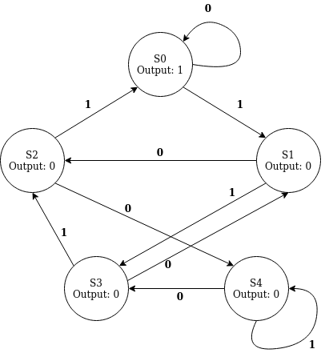

# Digital Design Lab 2

## Contents
- [Digital Design Lab 2](#digital-design-lab-2)
  - [Contents](#contents)
  - [Before you start](#before-you-start)
    - [Optional: NAND Game](#optional-nand-game)
    - [Important terminology](#important-terminology)
  - [Hand-Synthesis](#hand-synthesis)
  - [Divisible-by-5 FSM](#divisible-by-5-fsm)
  - [Synthesis](#synthesis)

## Before you start

### Optional: NAND Game
[NAND Game](https://www.nandgame.com/) is a pretty good browser-based logic-gate game that walks you through the layers of abstraction going from NAND gates to a functional (albeit simplistic) microprocessor. This isn't required, but it is a fun way to see how things are built up from gates.

### Important terminology
- Serial Data: Data that is sent 1 (or a few) bits at a time, instead of being presented all at once in parallel. 
- Most/Least-significant-bit first: Direction of a serial data stream. MSB sends bits from highest to lowest place-value, LSB is the opposite.

## Hand-Synthesis
As a refresher, the process of converting a higher-level description into a circuit *netlist*, or gate-level representation, is called *synthesis*. As a first exercise, try synthesizing the following SystemVerilog description into gates by hand. You can use any of the basic gates (AND, OR, NOT, NAND, NOR) with any number of inputs (e.g. 3-input AND) in addition to 2-input XOR and XNOR, 2:1 muxes, N-bit full adders, and D Flip-Flops with active-low reset. Draw a diagram (by hand if you want).


```sv
module decoder(
    input clk,
    input n_rst,
    input [1:0] address,
    output logic [3:0] select
);

    logic [1:0] addr_ff; // address flip-flops

    always_ff @(posedge clk, negedge n_rst) begin
        if(!n_rst) begin
            addr_ff <= 0;
        end else begin
            addr_ff <= address;
        end
    end

    assign select = (4'b1 << addr_ff);

endmodule
```
This module describes a small decoder, where the address is stored in D Flip-Flops. The output is a one-hot encoding of the input, i.e. for address N, the Nth bit of output is set to 1. This is summarized in the following table (numbers are binary).

| address | select |
|:-------:|:------:|
|   00    |  0001  |
|   01    |  0010  |
|   10    |  0100  |
|   11    |  1000  |


**Task**: Draw a gate-level circuit that would implement this. 

## Divisible-by-5 FSM
Divisibility of a binary number, sent as an MSB-first serial data stream, can be easily recognized by a Finite State Machine. For this part of the lab, you will implement an FSM that detects if a number is divisible by 5, as specified in the image below:



**Question**: Why does this work? As a hint, consider the states to be the "current value" (e.g the number that has been "shifted in") modulo 5.

In the file `./src/fsm.sv`, you will need to fill in the code that implements the FSM specified in the above figure. Next, look at the code in `./tb/tb_fsm.sv`. This TB is more involved than those in Lab 1, and will require filling in more of the code. At a high level, the TB uses two core tasks for testing: `send_bit`, and `send_stream`. `send_bit` sends a single bit of your input to the FSM, while `send_stream` *uses* `send_bit` many times to send a larger stream of data to the FSM. The testbench uses the `TestVector` struct to organize the data and bundle it with metadata such as the expected FSM output.

**Task**: Implement the divisible-by-5 state machine, and fill in the missing parts of the TB. Ensure that all tests pass.

**Question**: What would you need to add to this FSM to allow it to restart without pulsing the asynchronous reset?
> Note: Asynchronous resets usually pertain to many modules, and are usually used only after the device powers on, so using the asynchronous reset is not usually possible during runtime.

## Synthesis
For this lab, you will use [Yosys](https://yosyshq.net/yosys/) to synthesize your design. To do synthesis, you also need a *cell library*: a list of
the gates that the tool can use when generating a netlist from your SystemVerilog code. You will use [FreePDK45](https://eda.ncsu.edu/freepdk/freepdk45/),
an open PDK (and cell library) for a 45nm process. The synthesis script for Yosys is provided.

To get started, make sure to load the Yosys and FreePDK45 modules on asicfab:
```bash
$ module load yosys/0.45 freepdk45
```
The FreePDK45 module will give you a warning; this is fine. The FreePDK45 module exports a couple of environment variables that will be used to load the
cell library into Yosys.

Synthesis goes through a few basic steps:
1. Read HDL code into the tool
2. "Elaborate" the design, which converts it into an abstract internal representation
3. Optimization of the internal representation these are generic optimizations, such as constant propagation
4. Tech mapping: Map the internal representation onto the cell library; that is, replace the "gates" in the IR with one or more cells from the library
Of course, synthesis tools do more optimization and analysis beyond what is listed above.

Next, you can run synthesis with the command `make syn`. This will run Yosys on the script `syn.tcl`, and synthesis results will be placed in a folder 
named `syn` in your current directory. 

Inspect the files in the output:

`fsm_syn.v` - The *netlist* resulting from synthesis. This is another Verilog file, but contains only wires and gate instantiations.

`pre_syn.svg` and `post_syn.svg` - Visual representations of the design in different phases. `pre_syn.svg` shows Yosys's abstract internal representation; `post_syn.svg` shows the gate-level representation with FreePDK45 cells.
> SVG files can be viewed with the `display` command

`area.rpt` gives an area estimate of the design based on the cells used.

`yosys_run.log` is the full output of Yosys from the full run.

**Questions**:

1. Look at `area.rpt`. How many cells are used? How many D-Flip-Flops are there? How much of the area is taken up by DFFs compared to logic?
2. The `area.rpt` shows gates named `AND3`, `AND4`, `NOR3` and `OR3` that describe multi-input gates. Additionally, it uses gates `OAI211`, `OAI21`, and `AOI21`. Look up what these gates do and explain. Additionally, draw out a transistor-level schematic for any one of these gates
3. The `post_syn.svg` image is likely difficult to look at. This is because Yosys didn't really understand the function of the gates when it read in the cell library file. We can also synthesize to generic gates (gates not part of a cell library, just behavioral models included in the synthesis tool). A script to do this has been provided for you. Run `make syn_generic` to generate a `syn_generic` folder in your directory with all the same files as the `syn` folder. Inspect the `post_syn.svg` created from this. How is the `accept` signal computed? You can give an equation, truth table, or logic gate diagram. (Hint: Find the `accept` output on the diagram, and trace the cone of logic backwards to the state register DFFs)
